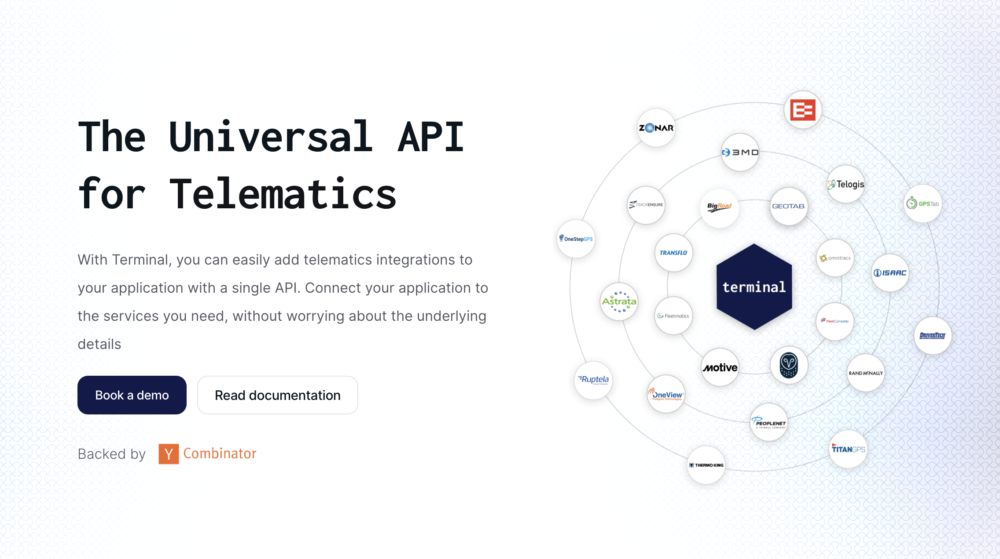

<div align="left">

[](https://withterminal.com)

# [Terminal](https://withterminal.com)

Terminal is a unified API that makes it easy to integrate with the leading telematics service providers.

Contact Support:
 Name: Terminal
 Email: connect@withterminal.com

</div>

## Requirements

Building the API client library requires:

1. Java 1.8+
2. Maven (3.8.3+)/Gradle (7.2+)

If you are adding this library to an Android Application or Library:

3. Android 8.0+ (API Level 26+)

## Installation<a id="installation"></a>
<div align="center">
  <a href="https://konfigthis.com/sdk-sign-up?company=Terminal&language=Java">
    
  </a>
</div>

### Maven users

Add this dependency to your project's POM:

```xml
<dependency>
  <groupId>com.konfigthis</groupId>
  <artifactId>terminal-java-sdk</artifactId>
  <version>1.0.0</version>
  <scope>compile</scope>
</dependency>
```

### Gradle users

Add this dependency to your `build.gradle`:

```groovy
// build.gradle
repositories {
  mavenCentral()
}

dependencies {
   implementation "com.konfigthis:terminal-java-sdk:1.0.0"
}
```

### Android users

Make sure your `build.gradle` file as a `minSdk` version of at least 26:
```groovy
// build.gradle
android {
    defaultConfig {
        minSdk 26
    }
}
```

Also make sure your library or application has internet permissions in your `AndroidManifest.xml`:

```xml
<!--AndroidManifest.xml-->
<?xml version="1.0" encoding="utf-8"?>
<manifest xmlns:android="http://schemas.android.com/apk/res/android"
    xmlns:tools="http://schemas.android.com/tools">
    <uses-permission android:name="android.permission.INTERNET"/>
</manifest>
```

### Others

At first generate the JAR by executing:

```shell
mvn clean package
```

Then manually install the following JARs:

* `target/terminal-java-sdk-1.0.0.jar`
* `target/lib/*.jar`

## Getting Started

Please follow the [installation](#installation) instruction and execute the following Java code:

```java
import com.konfigthis.client.ApiClient;
import com.konfigthis.client.ApiException;
import com.konfigthis.client.ApiResponse;
import com.konfigthis.client.Terminal;
import com.konfigthis.client.Configuration;
import com.konfigthis.client.auth.*;
import com.konfigthis.client.model.*;
import com.konfigthis.client.api.AuthenticationApi;
import java.util.List;
import java.util.Map;
import java.util.UUID;

public class Example {
  public static void main(String[] args) {
    Configuration configuration = new Configuration();
    configuration.host = "https://api.sandbox.withterminal.com/tsp/v1";
    
    // Configure HTTP bearer authorization: bearerAuth
    configuration.token = "BEARER TOKEN";
    Terminal client = new Terminal(configuration);
    String publicToken = "publicToken_example";
    try {
      client
              .authentication
              .exchangeToken()
              .publicToken(publicToken)
              .execute();
    } catch (ApiException e) {
      System.err.println("Exception when calling AuthenticationApi#exchangeToken");
      System.err.println("Status code: " + e.getStatusCode());
      System.err.println("Reason: " + e.getResponseBody());
      System.err.println("Response headers: " + e.getResponseHeaders());
      e.printStackTrace();
    }

    // Use .executeWithHttpInfo() to retrieve HTTP Status Code, Headers and Request
    try {
      client
              .authentication
              .exchangeToken()
              .publicToken(publicToken)
              .executeWithHttpInfo();
    } catch (ApiException e) {
      System.err.println("Exception when calling AuthenticationApi#exchangeToken");
      System.err.println("Status code: " + e.getStatusCode());
      System.err.println("Reason: " + e.getResponseBody());
      System.err.println("Response headers: " + e.getResponseHeaders());
      e.printStackTrace();
    }
  }
}

```

## Documentation for API Endpoints

All URIs are relative to *https://api.sandbox.withterminal.com/tsp/v1*

Class | Method | HTTP request | Description
------------ | ------------- | ------------- | -------------
*AuthenticationApi* | [**exchangeToken**](docs/AuthenticationApi.md#exchangeToken) | **POST** /public-token/exchange | Public Token Exchange
*ConnectionsApi* | [**createCustomConnection**](docs/ConnectionsApi.md#createCustomConnection) | **POST** /connections | Create Connection
*ConnectionsApi* | [**getCurrentDetails**](docs/ConnectionsApi.md#getCurrentDetails) | **GET** /connections/current | Get Current Connection
*ConnectionsApi* | [**listAll**](docs/ConnectionsApi.md#listAll) | **GET** /connections | List All Connections
*ConnectionsApi* | [**updateCurrentConnectionDetails**](docs/ConnectionsApi.md#updateCurrentConnectionDetails) | **PATCH** /connections/current | Update Current Connection
*DataManagementApi* | [**getSyncStatus**](docs/DataManagementApi.md#getSyncStatus) | **GET** /syncs/{id} | Get Sync Job Status
*DataManagementApi* | [**listSyncHistory**](docs/DataManagementApi.md#listSyncHistory) | **GET** /syncs | List Sync History
*DataManagementApi* | [**makePassthroughRequest**](docs/DataManagementApi.md#makePassthroughRequest) | **POST** /passthrough | Passthrough
*DataManagementApi* | [**requestSyncManual**](docs/DataManagementApi.md#requestSyncManual) | **POST** /syncs | Request Sync
*DriversApi* | [**getDetails**](docs/DriversApi.md#getDetails) | **GET** /drivers/{id} | Get Driver
*DriversApi* | [**list**](docs/DriversApi.md#list) | **GET** /drivers | List Drivers
*GroupsApi* | [**getAllGroups**](docs/GroupsApi.md#getAllGroups) | **GET** /groups | List Groups
*HoursOfServiceApi* | [**getAvailableTime**](docs/HoursOfServiceApi.md#getAvailableTime) | **GET** /hos/available-time | Available Time for Drivers
*HoursOfServiceApi* | [**getDailyLogs**](docs/HoursOfServiceApi.md#getDailyLogs) | **GET** /hos/daily-logs | List HOS Daily Logs
*HoursOfServiceApi* | [**listHosLogs**](docs/HoursOfServiceApi.md#listHosLogs) | **GET** /hos/logs | List HOS Logs
*IftaApi* | [**getMonthlyReports**](docs/IftaApi.md#getMonthlyReports) | **GET** /ifta/summary | Get IFTA Summary
*IssuesApi* | [**listObservedEvents**](docs/IssuesApi.md#listObservedEvents) | **GET** /issues | List Issues
*IssuesApi* | [**markResolved**](docs/IssuesApi.md#markResolved) | **POST** /issues/{issueId}/resolve | Resolve Issue
*ProvidersApi* | [**getList**](docs/ProvidersApi.md#getList) | **GET** /providers | List Providers
*SafetyApi* | [**getEvents**](docs/SafetyApi.md#getEvents) | **GET** /safety/events | List Safety Events
*TrailersApi* | [**getAllTrailers**](docs/TrailersApi.md#getAllTrailers) | **GET** /trailers | List Trailers
*TrailersApi* | [**listLatestLocations**](docs/TrailersApi.md#listLatestLocations) | **GET** /trailers/locations | Latest Trailer Locations
*TripsApi* | [**getAllTrips**](docs/TripsApi.md#getAllTrips) | **GET** /trips | List Trips
*VehiclesApi* | [**getAll**](docs/VehiclesApi.md#getAll) | **GET** /vehicles | List Vehicles
*VehiclesApi* | [**getDetails**](docs/VehiclesApi.md#getDetails) | **GET** /vehicles/{id} | Get Vehicle
*VehiclesApi* | [**getHistoricalStats**](docs/VehiclesApi.md#getHistoricalStats) | **GET** /vehicles/{vehicleId}/stats/historical | Historical Vehicle Stats
*VehiclesApi* | [**getLatestLocations**](docs/VehiclesApi.md#getLatestLocations) | **GET** /vehicles/locations | Latest Vehicle Locations
*VehiclesApi* | [**listHistoricalLocations**](docs/VehiclesApi.md#listHistoricalLocations) | **GET** /vehicles/{vehicleId}/locations | Historical Vehicle Locations


## Documentation for Models

 - [AuthenticationExchangeTokenRequest](docs/AuthenticationExchangeTokenRequest.md)
 - [ConnectionsCreateCustomConnectionRequest](docs/ConnectionsCreateCustomConnectionRequest.md)
 - [ConnectionsCreateCustomConnectionRequestBackfill](docs/ConnectionsCreateCustomConnectionRequestBackfill.md)
 - [ConnectionsCreateCustomConnectionRequestCompany](docs/ConnectionsCreateCustomConnectionRequestCompany.md)
 - [ConnectionsCreateCustomConnectionRequestCredentials](docs/ConnectionsCreateCustomConnectionRequestCredentials.md)
 - [ConnectionsUpdateCurrentConnectionDetailsRequest](docs/ConnectionsUpdateCurrentConnectionDetailsRequest.md)
 - [ConnectionsUpdateCurrentConnectionDetailsRequestCompany](docs/ConnectionsUpdateCurrentConnectionDetailsRequestCompany.md)
 - [DataManagementMakePassthroughRequestRequest](docs/DataManagementMakePassthroughRequestRequest.md)
 - [DataManagementRequestSyncManualRequest](docs/DataManagementRequestSyncManualRequest.md)


## Author
This Java package is automatically generated by [Konfig](https://konfigthis.com)
